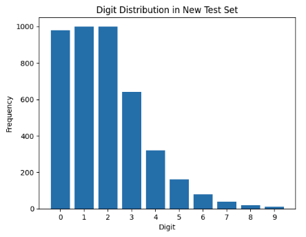

# distribution-shift-and-domain-shift

### Model Choice

For this assignment, I used the first model from Programming Assignment 3, Part 1. This model utilized a pre-trained ResNet50 with ImageNet and was fine-tuned on a modified MNIST dataset. The modified MNIST dataset was created by reflecting images, rotating them by 90 degrees, and translating them right by five pixels.

Distribution shift refers to a scenario where the test data follows a different probability distribution than the training data. This discrepancy can lead to performance degradation as the patterns learned during training may not generalize well to the test data. Evaluating a model under such conditions helps assess and improve its robustness.

This model was the best choice among those used in previous assignments because it was trained on a modified MNIST dataset, meaning it had already learned strong MNIST-specific features. Additionally, it was trained on a balanced dataset, making it more likely to handle shifts in data distribution. I considered using the second model from Part 1 Assignment 3, but I ultimately selected this one because that model had only two output labels, whereas this model supports all ten class labels. Moreover, the data distribution of the second model differed significantly from the original MNIST dataset.

### Hypothesis

Due to the distribution shift and domain shift, I expect the test accuracy to be significantly lower than that of the original model. The model may struggle because of the imbalanced test data, and as the new test set (original MNIST) is different from the training data (modified MNIST). 

### Result

The original model, trained with ResNet50 and fine-tuned on the modified MNIST dataset achieved:
- Test Loss: 0.6298
- Test Accuracy: 78.40%

After applying the new test distribution, the model's performance dropped to:
- New Test Loss: 6.4058
- New Test Accuracy: 4.38%

We observe that compared to the original model's test accuracy (78.40%), the test accuracy under the distribution shift significantly drops to 4.38%. This drop occurs because the model was trained on a balanced dataset but is now tested on an imbalanced distribution. The model likely assigns higher confidence to frequently occurring digits in the original training set, making it less effective at recognizing underrepresented digits in the new test set. Also, since the train and test datasets are mismatched (domain shift), the model has learned features that might not generalize well to the original dataset, thus causing additional degradation in accuracy. 

At this point, I was curious what happens if I only perform a distribution shift, without domain shift. As I saved the modified MNIST dataset from Programming Assignment 3, I decided to experiment with the same model (HW3's Part 1's first model) and use the modified MNIST dataset as the test set, but differ the distribution rate only (no domain shift).

## Distribution Shift, Right-Skewed

Before the experiment, I expected that we would have a lower test accuracy compared to the original model (78.40%). But, indeed, I got 0.4308 test loss and 85.81% test accuracy, which is higher than the original model. I researched why this happens and found that, with a distribution shift, the accuracy can either increase or decrease depending on how well my model performs on each digit. In my case, the model performs well on "0", "1", and "2". This results in an increase in overall accuracy since accuracy is a weighted average of per-class accuracy. I wanted to check if I reversed the sample distribution, whether the test accuracy would be lower than the original model (78.40%).

## Distribution Shift, Left-Skewed

With this setup, I got 0.7797 test loss and 73.66% test accuracy, which is slightly lower than the original model (78.40%) and meets our expectations. Since the test set had mostly difficult digits to classify (e.g., '9', '8'), accuracy drops because the model is weaker on these classes. We can observe that class 8 and 9, even though we tested 1000 images, only 697 cases and 673 cases were correctly classified. This differs from the distribution shift model with the right-skewed distribution, where 908 cases were correctly classified for class 0, 993 cases for class 1, and so on. This shows that the model naturally distinguishes classes 0, 1, and 2 better compared to classes 7, 8, and 9.

---

## Proof (Prediction) of Test Accuracy

### Domain Shift + Distribution Shift

#### Formula Setup

Given that the probability of each digit is denoted as $\(p_0, p_1, p_2, \dots, p_9\)$ and they sum to 1:

$$ \sum_{i=0}^{9} p_i = 1 $$

Let $\(a_i\)$ represent the model's accuracy for digit $\(i\)$, which is the fraction of correctly classified samples for that digit. The overall expected test accuracy, $\(A\)$, is then a weighted sum of per-class accuracies:

$$
A = \sum_{i=0}^{9} p_i a_i
$$

We know that:
- $\(p_i\)$ is the proportion of digit $\(i\)$ in the test set: $\(\frac{\text{the number of samples of digit } i}{\text{total test samples}}\)$.
- \(a_i\) is the fraction of correctly classified digit $\(i\)$ samples: $\(\frac{\text{correct predictions for digit } i}{\text{total samples of digit } i}\)$.

Since $\(p_i\)$'s numerator is the same as $\(a_i\)$'s denominator, we can simplify it as:

$$
A = \sum_{i=0}^{9} \frac{\text{correct predictions for digit } i}{\text{total test samples}}
$$

#### Proof

For the easy calculation for the proof, I used the confusion matrix below.

Using the confusion matrix (Figure~\ref{fig:Q5_cm}) from our model's performance on the new test set:

$$
A = \sum_{i=0}^{9} \frac{\text{correct predictions for digit } i}{\text{total test samples}}
$$

Substituting actual values:

$$
A = \frac{81}{4270} + \frac{37}{4270} + \frac{1}{4270} + \frac{19}{4270} + \frac{22}{4270} + \frac{7}{4270} + \frac{0}{4270} + \frac{3}{4270} + \frac{16}{4270} + \frac{0}{4270}
$$

$$
A = \frac{180}{4270} = 0.04355 \approx 4.36\%
$$

This result closely matches our observed test accuracy (4.38%), with a small difference of 0.02%. This discrepancy is likely due to rounding errors, computational variations, or something else during model evaluation. However, the theoretical calculation is very close to the actual result, validating our formula.

### Distribution Shift, Right-Skewed

Similar to above, I double-checked the accuracy with the formula:

$$
A = \frac{908}{4270} + \frac{993}{4270} + \frac{644}{4270} + \frac{592}{4270} + \frac{305}{4270} + \frac{108}{4270} + \frac{48}{4270} + \frac{31}{4270} + \frac{12}{4270} + \frac{6}{4270}
$$

$$
A = \frac{3647}{4270} = 0.8540 \approx 85.41\%
$$

There is a small discrepancy $(\(\approx 0.4\%\))$, but we see that the theoretical calculation is very close to the actual result.

### Distribution Shift, Left-Skewed

Similar to above, I double-checked the accuracy with the formula:

$$
A = \frac{10}{4270} + \frac{20}{4270} + \frac{26}{4270} + \frac{75}{4270} + \frac{155}{4270} + \frac{225}{4270} + \frac{386}{4270} + \frac{859}{4270} + \frac{697}{4270} + \frac{673}{4270}
$$

$$
A = \frac{3126}{4270} = 0.7320 \approx 73.21\%
$$

There is a small discrepancy ($\approx 0.45\%$), but we see that the theoretical calculation is very close to the actual result.
